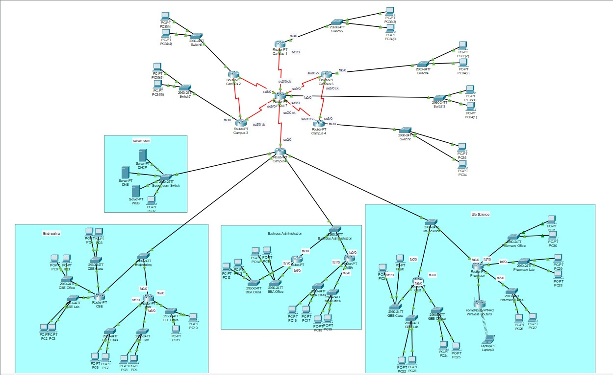
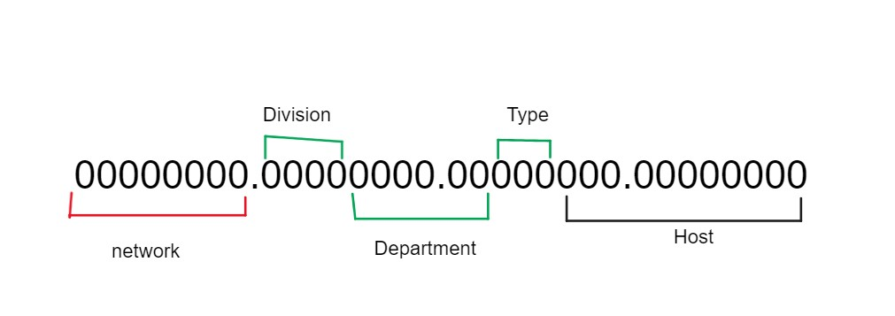

# UniversityNetworkDesign

 Designing a network for an university with multiple campuses.

 University of Scholars is a university with multiple campuses having multiple departments. In this project, a professional network design demonstration has been given for this university. This university has wired internet access to all the classrooms, labs, employee PCs, library and other administrative and academic wings, the university also provides wireless internet access for every campus. On top of that, the university runs a complex networked system to support several of its business processes like admissions, advising, results, eTender, library management, accounts and so on.

Tasks--------

There are several requirements to be ensured in this network and those are given below-
-There is a university web page that can be accessed through every device
-A single DNS server will provide the domain name www.scholars.edu.bd
-A single DHCP address will provide all the IP addresses for the end device
-Connectivity between the host needs to be established
-All the campuses are connected using the topology given below

Campus hierarchy--------

To implement this project first we need to organise the hierarchy of the university campus. In this scenario, this university has seven campuses. Assuming each campus has multiple divisions such as Engineering, Life Science, Business Administration and many more. Each division has various departments such as Engineering has CSE, and EEE. Life Science has GEB and pharmacy. Business Administration has BBA and MBA. At the very bottom, each department has a different type of activity such as class, lab, office etc.
We have to provide IP addresses in such a way so that every division, department and type of activity falls into different subnets.

Network Design--------

In this project, we are assuming campus 6 to be the main campus. Design inside a campus has been shown for campus 6. Other campuses will be implemented in the same way.
We are using Class A IP for inside the campus. Class C IP will be used to connect one campus to another campus. Class B will be used inside campus 3 assuming it has lesser subnets and hosts. As discussed earlier a campus will have divisions, departments and types of activity we will choose 13 bits for subnetting and as we are taking class A, the first 8 bits will be kept for the network.  
The network part of the IP will be as same as the campus number. For example, if it is Campus 6, the network IP will be 6.0.0.0. The next 13 bits are kept for subnetting. Among them, the first 4 bits are for the division, 6 bits for the department, 3 bits for the section and 11 bits for the Host.
In this way, we get 211-2=2046 number of hosts for each subnet. 

For the outer campus, we will use class C. For design simplicity, we are choosing the network IP in the given way below.
192.<source>.<desitnation>.Host
If campus 1 is connected to campus 7 the network will be 192.1.7.0
